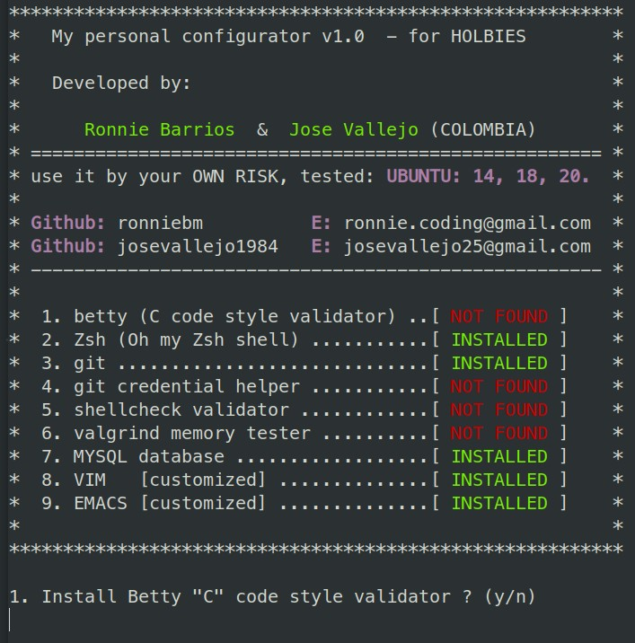

# Script Configurators.  
  
#### FILE:  "a_config.sh" .
---------------------------------
This script assistant will let you install:  

     1. Betty "C" code style validator.  
     2. Zsh (Oh my Zsh shell).  
     3. git.  
     4. git credential helper.  
     5. shellcheck validator.  
     6. valgrind memory tester.  
     7. MYSQL database.  
     8. VIM   [customized].  
     9. EMACS [customized].  

---------------------------------  

#### How to use:  

    1. $ git clone https://github.com/ronniebm/script_configurators  
    2. $ cd script_configurators  
    3. $ ./a_config.sh  

---------------------------------  

#### Menu image:  
  

---------------------------------  

<b>Authors:</b> Ronnie Barrios,  Jose Vallejo.  
<b>Emails:</b> ronnie.coding@gmail.com,  josevallejo25@gmail.com  
<b>github:</b> ronniebm,  josevallejo1984  
